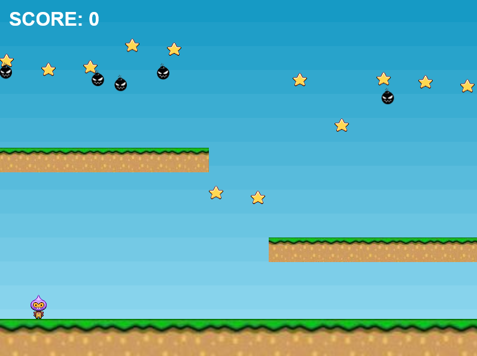

## :rocket: Jogo com Phaser

### :art: Layout

  

----------

### :hammer_and_wrench: Ferramentas
As seguintes tecnologias foram utilizadas na construção do projeto:
- Phaser;
- HTML;
- JavaScript.

----------

###  :gear: Função
- [x] Coletar estrelas com o herói intergaláctico.

----------

###  :eyeglasses: Autor
José Gustavo da Silva.
 

